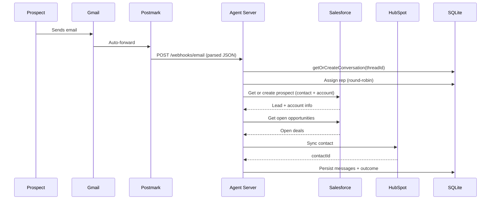
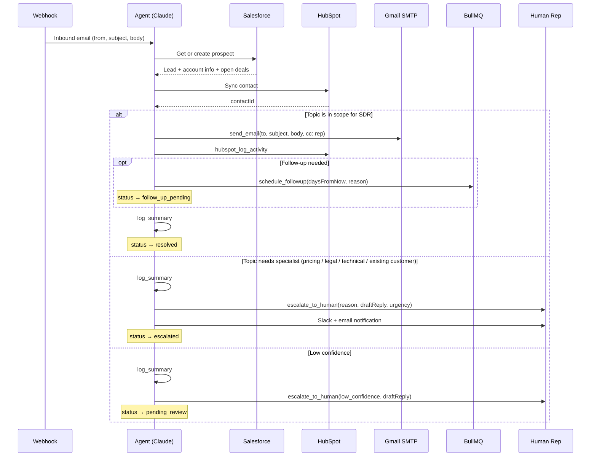
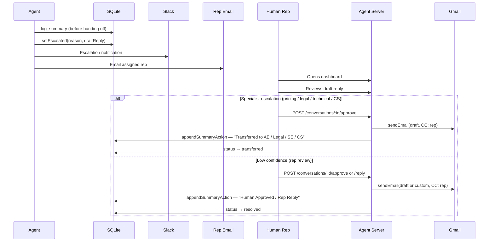
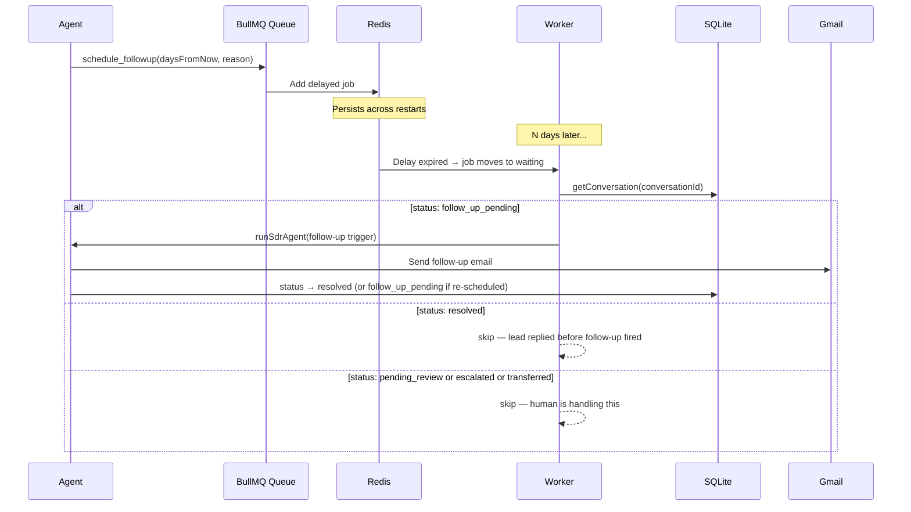
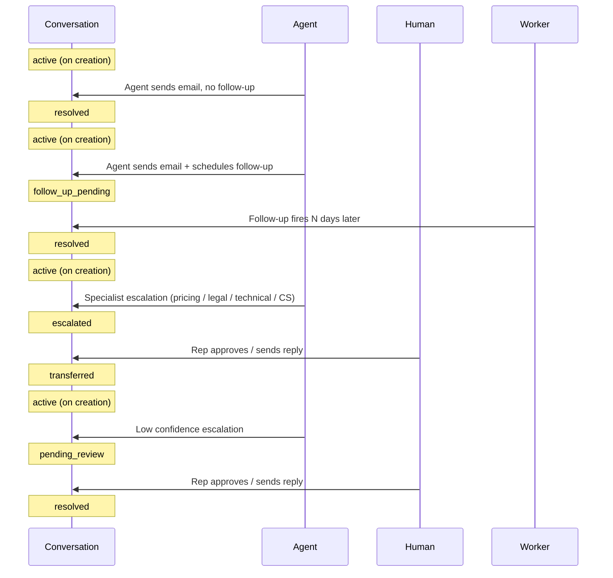

# SDR Agent

An AI-powered Sales Development Representative that handles inbound emails, qualifies leads, pulls context from Salesforce, logs to HubSpot, and escalates out-of-scope conversations to human reps — autonomously and repeatably.

---

## Architecture

```
Prospect emails you
       ↓
Gmail receives it → auto-forwards to Postmark inbound address
       ↓
Postmark parses email → POST /webhooks/email
       ↓
SDR Agent (Claude claude-sonnet-4-6 + tool_use)
  ├── salesforce_get_contact     → fetch prospect context
  ├── salesforce_get_opportunities → fetch open deals
  ├── hubspot_upsert_contact     → ensure contact exists
  │
  ├── [In scope]
  │   ├── send_email             → Gmail SMTP reply (CC: assigned rep)
  │   ├── hubspot_log_activity   → log sent email
  │   └── schedule_followup      → BullMQ delayed job (N days)
  │
  └── [Out of scope]
      └── escalate_to_human      → draft saved, Slack + email notification fired
                                    → "Needs Review" queue in dashboard
                                    → human approves / edits / discards
```

---

## Diagrams

### 1. Inbound Email Pipeline



### 2. Agent Decision Flow



### 3. Escalation & Human Review Flow



### 4. Follow-up Scheduler Flow



### 5. Conversation Status Lifecycle



---

## Project Structure

```
sdr-workflow/
  apps/
    agent-server/          # Bun HTTP server — agent orchestration (port 3001)
      src/
        agent/             # Claude SDK agentic loop, tools, system prompt
        integrations/
          salesforce/      # client.ts (real API) + mock.ts (seed data)
          hubspot/         # client.ts (real API) + mock.ts (in-memory)
          email/           # client.ts (nodemailer + Postmark inbound parser)
        db/                # SQLite store (bun:sqlite) — conversations, reps, followups
        notifications/     # Slack + email escalation notifications
        queue/             # BullMQ follow-up scheduler (Redis)
        webhooks/          # Postmark inbound parser + secret validation
        __tests__/         # Bun unit + integration tests
    web/                   # Next.js dashboard (port 3000)
      app/
        page.tsx           # Conversation list (All / Needs Review / Active / Resolved)
        conversations/[id] # Conversation detail + tool timeline + approve/discard UI
        reps/              # Sales rep roster management
```

---

## Setup

### 1. Install dependencies

```bash
bun install
```

### 2. Environment variables

Copy `.env.example` to `.env` and fill in the values:

```bash
cp .env.example .env
```

| Variable | Where to get it |
|----------|----------------|
| `ANTHROPIC_API_KEY` | [console.anthropic.com](https://console.anthropic.com) |
| `GMAIL_USER` | Your Gmail address |
| `GMAIL_APP_PASSWORD` | Google Account → Security → App Passwords |
| `POSTMARK_SERVER_TOKEN` | [postmarkapp.com](https://postmarkapp.com) → Server → API Tokens |
| `WEBHOOK_SECRET` | Any random string — append as `?secret=` to your Postmark inbound URL |
| `SF_CLIENT_ID` | Salesforce Setup → App Manager → Connected App → Consumer Key |
| `SF_CLIENT_SECRET` | Salesforce Setup → App Manager → Connected App → Consumer Secret |
| `SF_REFRESH_TOKEN` | One-time OAuth flow (see Salesforce setup below) |
| `HUBSPOT_ACCESS_TOKEN` | HubSpot → Settings → Integrations → Private Apps |
| `SLACK_WEBHOOK_URL` | [api.slack.com/apps](https://api.slack.com/apps) → Incoming Webhooks |
| `REDIS_URL` | `redis://localhost:6379` or Upstash URL |
| `DASHBOARD_URL` | Your dashboard public URL (used in Slack notification links) |

### 3. Salesforce OAuth (one-time)

```bash
# 1. Generate PKCE values
VERIFIER=$(openssl rand -base64 32 | tr -d "=+/" | cut -c1-43)
CHALLENGE=$(echo -n $VERIFIER | openssl dgst -sha256 -binary | openssl base64 | tr -d "=" | tr "+/" "-_")

# 2. Open in browser (replace CLIENT_ID and CHALLENGE)
# https://login.salesforce.com/services/oauth2/authorize?response_type=code
#   &client_id=CLIENT_ID&redirect_uri=http://localhost:3001/oauth/callback
#   &code_challenge=CHALLENGE&code_challenge_method=S256

# 3. Copy the code from the redirect URL, then exchange:
curl -X POST https://login.salesforce.com/services/oauth2/token \
  -d "grant_type=authorization_code" \
  -d "client_id=YOUR_CLIENT_ID" \
  -d "client_secret=YOUR_CLIENT_SECRET" \
  -d "redirect_uri=http://localhost:3001/oauth/callback" \
  -d "code=CODE_FROM_URL" \
  -d "code_verifier=$VERIFIER"
# Copy refresh_token from response → SF_REFRESH_TOKEN
```

### 4. HubSpot Private App scopes

When creating the Private App, select these scopes:
```
crm.objects.contacts.read
crm.objects.contacts.write
crm.objects.deals.read
crm.objects.deals.write
```

### 5. Inbound email (Gmail → Postmark)

1. Get your Postmark inbound address from **postmarkapp.com → your server → Inbound**
2. Set your Postmark webhook URL to: `https://your-domain.com/webhooks/email?secret=YOUR_WEBHOOK_SECRET`
3. Gmail → Settings → Forwarding → Add forwarding address → paste Postmark inbound address

For local dev, expose the server with [ngrok](https://ngrok.com): `ngrok http 3001`

### 6. Start Redis

```bash
# Docker
docker run -d -p 6379:6379 redis

# Homebrew
brew services start redis
```

---

## Running

```bash
# Start everything (agent-server + dashboard + docs)
bun dev

# Agent server only (port 3001)
cd apps/agent-server && bun run dev

# Dashboard only (port 3000)
cd apps/web && bun run dev
```

---

## Testing

```bash
cd apps/agent-server

# Unit tests (no external services needed)
bun run test

# Integration tests (requires Redis)
REDIS_URL=redis://localhost:6379 DB_PATH=:memory: bun test src/__tests__/followup.integration.test.ts

# Watch mode
bun run test:watch
```

---

## Email Flows

### Happy path (agent handles autonomously)

```bash
curl -X POST localhost:3001/webhooks/email \
  -H "Content-Type: application/json" \
  -d '{
    "from": "alex.rivera@acme.com",
    "subject": "Tell me about your platform",
    "body": "Hi, we have 500 engineers evaluating tools."
  }'
# → emailSent: true, escalated: false
```

### Escalation path (out of scope — human review required)

```bash
curl -X POST localhost:3001/webhooks/email \
  -H "Content-Type: application/json" \
  -d '{
    "from": "alex.rivera@acme.com",
    "subject": "Pricing question",
    "body": "What does enterprise pricing look like? We need a custom contract."
  }'
# → escalated: true, emailSent: false
# → Slack notification fired, rep emailed, conversation in "Needs Review" tab
```

### Approve a draft

```bash
curl -X POST localhost:3001/conversations/<id>/approve
# → Email sent with rep CC'd, HubSpot logged, status → resolved
```

### Follow-up scheduling

```bash
curl -X POST localhost:3001/webhooks/email \
  -H "Content-Type: application/json" \
  -d '{
    "from": "alex.rivera@acme.com",
    "subject": "Not the right time",
    "body": "Budget cycle starts in Q3. Check back then."
  }'
# → Agent replies, schedules follow-up job in Redis for ~60 days
```

---

## API Routes

| Method | Path | Description |
|--------|------|-------------|
| `POST` | `/webhooks/email` | Inbound email trigger |
| `GET` | `/conversations` | List conversations (`?status=pending_review`) |
| `GET` | `/conversations/:id` | Full conversation + tool timeline |
| `POST` | `/conversations/:id/approve` | Approve draft → send email |
| `POST` | `/conversations/:id/reply` | Human sends custom reply |
| `POST` | `/conversations/:id/reassign` | Reassign to different rep |
| `GET` | `/reps` | List sales reps |
| `POST` | `/reps` | Add a rep |
| `PUT` | `/reps/:id` | Update rep |
| `DELETE` | `/reps/:id` | Remove rep |
| `GET` | `/health` | Health check |

---

## Escalation Reasons

| Reason | Routes to |
|--------|-----------|
| `pricing_or_quote` | Account Executive |
| `technical_deep_dive` | Solutions Engineer |
| `existing_customer` | Customer Success |
| `legal_or_contract` | Legal |
| `low_confidence` | Assigned Rep |

---

## Integrations

All integrations fall back to mock data when credentials are not set — the full agent pipeline works in dev without any external accounts.

| Service | Purpose | Fallback |
|---------|---------|---------|
| Salesforce | Prospect + opportunity context | Seed data (Alex Rivera, Jordan Kim) |
| HubSpot | Contact upsert, deal stage, activity logging | In-memory Map |
| Gmail SMTP | Outbound email sending | Console log |
| Postmark | Inbound email parsing + webhook | Manual curl |
| Slack | Escalation notifications | Console log |
| Redis / BullMQ | Follow-up scheduling | Disabled (warns on startup) |

---

## In Scope vs Out of Scope

**In scope** — topics an SDR rep handles day-to-day:
- General product questions ("what does your platform do?")
- Discovery questions ("how many engineers do you have?")
- Scheduling a demo or intro call
- Following up after no response
- Qualifying the lead

**Out of scope** — topics that need a different person:
- Pricing / custom quotes → Account Executive
- Technical deep-dives (architecture, integrations, latency) → Solutions Engineer
- "We're already a customer" → Customer Success
- Contracts, NDAs, compliance → Legal
- Anything the agent isn't confident about → Rep reviews

The agent decides this itself based on the system prompt rules. When it detects an out-of-scope topic, it stops, drafts a reply anyway, and puts the conversation in the "Needs Review" queue instead of sending autonomously.

The idea is — **the agent only acts alone when it's confident it's doing the right thing**. Everything else it hands off to a human with a suggested draft.
